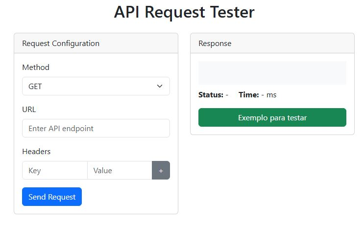

Explicando o projeto **API Request Tester**. Este projeto, tem como funcionalidade, uso e objetivo — como uma alternativa simplificada de testar requisições sem utilizar o Postman, ele pode ser testado diretamente no navegador sem ter que instalar diretamente nada ele pode ser utilizado em seu navegador mesmo:

---

```markdown
# 🚀 API Request Tester

O **API Request Tester** é uma ferramenta web simples e funcional para testar requisições HTTP de forma prática, diretamente no navegador. Inspirado no Postman, este projeto tem como objetivo facilitar o envio de requisições `GET`, `POST`, `PUT`, `PATCH` e `DELETE` para qualquer endpoint RESTful, exibindo as respostas em tempo real.

## 🔧 Tecnologias Utilizadas

- HTML5 + CSS3
- [Bootstrap 5.3](https://getbootstrap.com/)
- JavaScript puro (vanilla JS)
- Fetch API

## 🎯 Objetivo

Este projeto tem como missão:

- Ajudar desenvolvedores a testarem APIs de maneira rápida e prática;
- Ser uma alternativa leve e gratuita ao Postman;
- Servir como ferramenta de aprendizado sobre consumo de APIs REST.

## 🧪 Funcionalidades

- Envio de requisições HTTP com diferentes métodos (`GET`, `POST`, `PUT`, `PATCH`, `DELETE`);
- Inserção de headers personalizados (como tokens ou tipos de conteúdo);
- Envio de corpo da requisição em JSON;
- Exibição de:
  - Corpo da resposta;
  - Código de status HTTP;
  - Tempo de resposta em milissegundos;
- Exemplo prático embutido com a API pública [https://reqres.in/api/users/2](https://reqres.in/api/users/2).

## 📸 Captura de Tela



## ▶️ Como Usar

1. Abra o arquivo `index.html` no navegador;
2. Escolha o método HTTP desejado;
3. Insira a URL da API que deseja testar;
4. Adicione headers se necessário;
5. Se for o caso, insira o corpo da requisição em JSON;
6. Clique em **Enviar Requisição** e veja os resultados na área de resposta;
7. Use o botão **Exemplo para testar** para carregar um tutorial interativo com exemplos reais.

## 💡 Exemplo de Teste

```bash
GET https://reqres.in/api/users?page=1
```

**Headers:**

```json
{
  "Accept": "application/json"
}
```

**Resposta Esperada:**

```json
{
  "page": 1,
  "per_page": 6,
  "total": 12,
  "data": [...]
}
```

## 📁 Estrutura do Projeto

```
📦 api-request-tester
├── index.html        # Página principal com interface visual
├── script.js         # Lógica JS para envio das requisições
├── style.css         # (Opcional) Estilo adicional
└── README.md         # Documentação do projeto
```

## 📚 Referências

- [MDN - Fetch API](https://developer.mozilla.org/pt-BR/docs/Web/API/Fetch_API)
- [reqres.in - API para testes](https://reqres.in/api/users/2)

## 🧠 Autor

Desenvolvido por [Alemaodacapa](https://social.x10.mx) — apaixonado por desenvolvimento web, APIs e ferramentas que facilitam o dia a dia de devs.

---

> Este projeto é totalmente open-source e pode ser adaptado livremente para fins pessoais, educativos ou comerciais.
```
